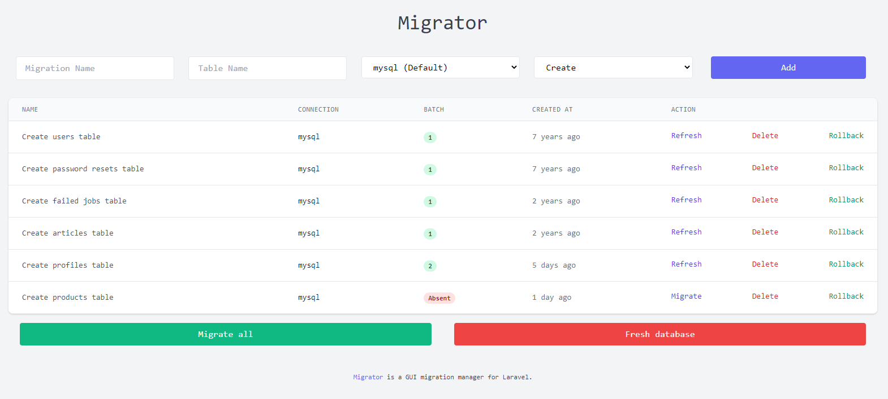

Migrator is a GUI migration manager for Laravel which you can create, manage and delete your migration.  
Also, with Migrator you will be able to use a feature called "Safe Migrate" which allows you to run migration without fear of foreign key sorting, it will automatically run migrations in the correct order and you don't need to change the migrations filename.

[https://github.com/rezaamini-ir/migrator](https://github.com/rezaamini-ir/migrator)
